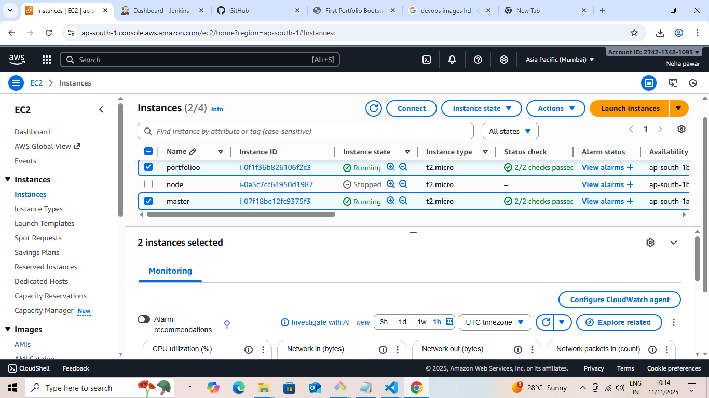
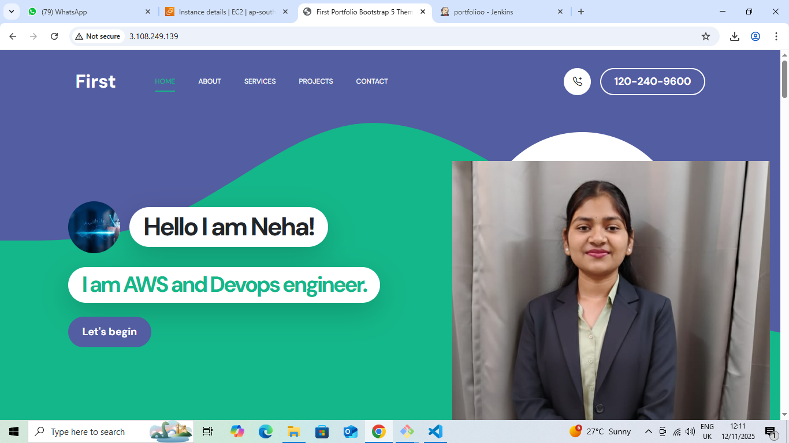

 
 #  Portfolio CI/CD Deployment using Jenkins & AWS EC2

##  Overview
This project demonstrates a **CI/CD pipeline** that automates the deployment of a personal **portfolio website** on an **AWS EC2 instance** using **Jenkins**.  
Whenever new code is pushed to the GitHub repository, Jenkins automatically builds and deploys the updated version — achieving smooth and hands-free deployment.

---

##  Architecture Summary

- **GitHub Repository:** Stores website source code and pipeline configuration.  
- **Jenkins Server (EC2):** Handles build and deployment automation.  
- **Deployment Server (EC2):** Hosts the portfolio site using Apache or Nginx.  
- **Webhook:** Connects GitHub and Jenkins to trigger builds automatically on each push.

### **Workflow:**
`Developer → GitHub → Jenkins → AWS EC2`

---

##  Tools Used

- **Version Control:** Git, GitHub  
- **Automation Tool:** Jenkins  
- **Hosting Platform:** AWS EC2  
- **Web Server:** Apache / Nginx  
- **Languages:** HTML, CSS, JavaScript  

---

##  Project Structure
├── index.html
├── style.css
├── script.js
├── Jenkinsfile
└── README.md

---

## 🔧 Setup & Deployment Steps

### 1️⃣ Launch EC2 Instances
Create two EC2 instances:
- One for **Jenkins**
- One for **Web Server**

Open required ports (**22**, **80**, **8080**) in security groups.

**📸 Screenshot – EC2 Setup:**  

---

### 2️⃣ Install Jenkins
- Install Jenkins and required plugins (`Git`, `Pipeline`, `SSH Agent`).  
- Create a new **Pipeline Job** and link it with your GitHub repository.

---

### 3️⃣ Configure Webhook
Go to your **GitHub Repository → Settings → Webhooks → Add Webhook**

** Screenshot – Webhook Configuration:**  

Choose **application/json** as the content type and trigger it on **Push events**.

** Screenshot – GitHub Push Trigger:**  

---

### 4️⃣ Jenkinsfile Example

## Output

After every push to the GitHub repository:

Jenkins automatically fetches the latest code.

The website is deployed on the EC2 instance.

Apache serves the updated portfolio instantly.

## Summary
This setup provides a fully automated deployment pipeline using Jenkins and AWS EC2.
It simplifies the process of hosting and updating web projects, ensuring fast and reliable delivery with minimal manual effort.

## Highlights (simple):
###  Key Highlights
- Fully automated CI/CD deployment using Jenkins
- Hands-free updates with every GitHub push
- Reliable hosting on AWS EC2 with Apache/Nginx
- Easy to extend for other web projects

